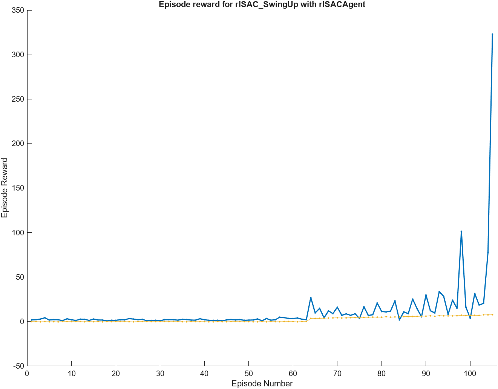

# Rotary Inverted Pendulum Control using SAC

[](https://www.mathworks.com/ )
[](https://www.python.org/ )
[](https://en.cppreference.com/w/cpp/17 )
[](https://pytorch.org/ )
[](LICENSE)

## Table of Contents
* [Introduction](#introduction)
* [Project Structure](#project-structure)
* [Requirements](#requirements)
* [Usage](#usage)
* [Results](#results)
* [Deployment](#deployment)
* [Technical Highlights](#technical-highlights)
* [Screenshots](#screenshots)
* [Author](#author)
* [License](#license)

## Introduction
In automation control, stabilizing the inverted pendulum is a widely studied problem. It has many real- applications such as: self-balancing, attitude control in spacecraft... 
In this project, I use the Soft-Actor-Critic (SAC) reinforcement learning to stabilize the inverted pendulum. The system is based on QUBE-Servo 2 platform from Quanser, which is simulated and train usinh Matlab applications. To validate the simulation results, the trained policy is deployed on the real hardware system. 

## Project Structure

```
rotary-pendulum-matlab/
├── matlab/
│   ├── agents/              # SAC agent configurations
│   ├── config/              # System parameters
│   ├── environment/         # RL environments
│   ├── scripts/
│   │   ├── training/        # Training scripts
│   │   ├── evaluation/      # Testing utilities
│   │   └── export/          # Weight export tools
│   ├── simulink/
│   │   ├── physics/         # Physics models
│   │   └── evaluation/      # Test models
│   └── trained_models/      # Saved checkpoints
├── python/                  # Python deployment interface
├── embedded/                # ESP32 firmware
├── hardware/                # Hardware documentation
└── docs/                    # Project documentation
```

## Requirements

* MATLAB R2023b or later
* Reinforcement Learning Toolbox
* Simulink & Simscape Multibody
* Simulink Coder (for code generation)
* Python 3.7+ (for exported policy inference)

## Usage

### Notation

- $\theta$ (theta): Angle of the rotary arm  
  Measured from the horizontal reference  
  Positive direction: clockwise (viewed from above)  
  Value range: $\theta \in (-\infty, +\infty)$

- $\alpha$ (alpha): Angle of the pendulum relative to the downward vertical  
  $\alpha = 0$: pendulum is pointing straight down  
  $\alpha = \pi$ or $-\pi$: pendulum is pointing straight up  
  Positive direction: clockwise  
  Value range: $\alpha \in (-\pi, \pi]$


### Traning stage
First, I trained the policy networks using MATLAB applications (see UserGuide.mlx in the natlab_sim folder). The training process is divided into two stages: swing-up policy and balance policy. The swing-up policy enables the inverted pendulum to reach an angle $\alpha$ of approximately 160 degrees, after which the balance policy stabilizes it at $\alpha = 0$.

Second, I embedded the generated C code into the ESP32 controller, which interfaces with the QUBE-Servo 2 hardware. The microcontroller is responsible for collecting sensor data (from the encoders) and computing the observation vector:
$\theta$, $\dot{\theta}$, $\alpha$, $\dot{\alpha}$
based on the raw sensor values.

Third, to enable real-time reinforcement learning on hardware, I use Python as a communication bridge. The microcontroller reads sensor values and sends them to Python, which then computes the control action using the trained policy weights from the simulation and sends the action back to the microcontroller for actuation.

## Results
### Swing-up Controller
<p align="center">
  
</p>
The swing-up controller learned to bring the pendulum from rest to upright in about 2 seconds on average.  
Average return: +250

### Balance Controller
<p align="center">
  
</p>
The balance controller was trained for 400 epochs and successfully maintains the upright position with minimal oscillation although small white noise added.  
Average return: +312

---

### Demo Videos
<p align="center">
  
</p>


## Deployment
I use the **ESP32-WROOM-32** microcontroller as the main onboard system for communication and control.  
The trained policy is exported and deployed to run inference directly on the microcontroller in real time.
<p align="center">
  <a href="https://youtube.com/shorts/Z7KgSk4hNu4" target="_blank">
    
  </a>
</p>

## Technical Highlights

* **Algorithm**: Soft Actor-Critic (SAC) with Gaussian policy
* **Architecture**: 2 hidden layers (ReLU), mean & log‑std outputs
* **Phases**: Separate Swing‑Up and Balance agents
* **Deployment**: Manual forward pass in MATLAB & Python

## Author

**Hong Quan** – Robotics & AI Enthusiast

## License

This project is licensed under the [MIT License](LICENSE).
